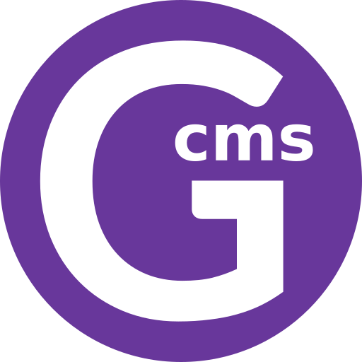
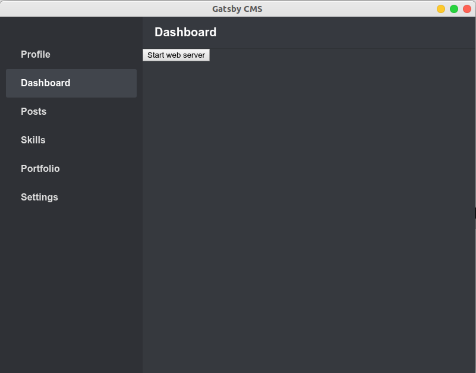

    

<h1 align="center">
    CMS for gatsby.js
</h1>
A content management system for gatsby.js. Empower all users to create static sites with react.

### Motivation
It is difficult to manage gatsby.js websites for blogs and portfolios, creating a gui application to manage them and build & deploy on 1-click will be great. 

### Product backlog
The product backlog is in artifacts folder. 

### Status
Development is in develop branch. Currently, working out communication with gatsby.js gui looks like this.

    

